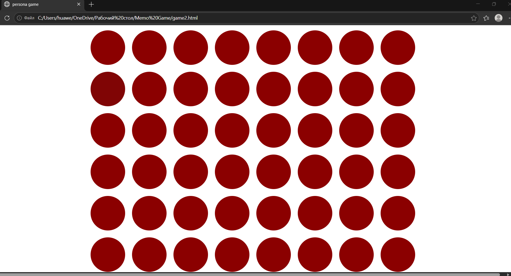
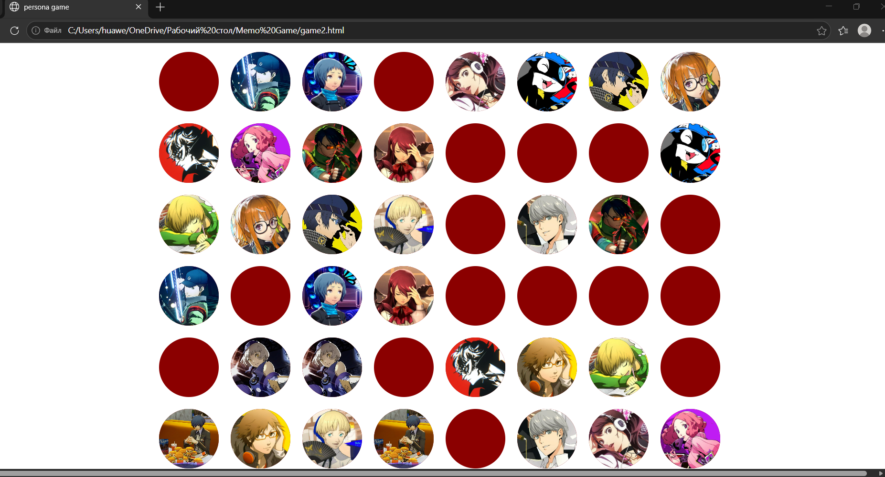

# Memo-Game

I used html to create this game. It includes functions and style block.

# Play
Just choose two cards every time to find a pair.

You can check file to see how it works.

Memo-Game: https://nikaklubnik.github.io/Memo-Game/
